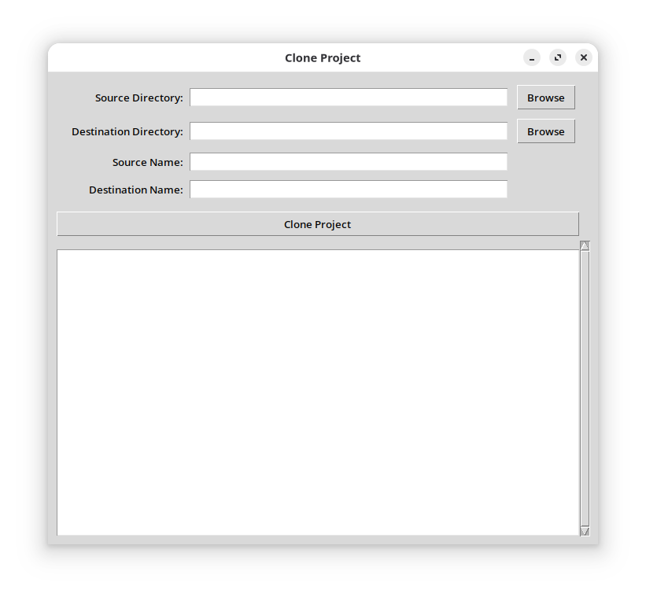

# CloneProject
Utility to clone a project via CLI or Tkinter GUI.

CloneProject takes an existing codebase and produces a fully renamed copy. You provide the source directory/name(s) and the destination directory/name(s) either via command-line arguments or through the Tkinter GUI. The script copies every file and folder, renaming paths that contain the original project name(s) and replacing occurrences of that name(s) inside text files. This makes it easy to bootstrap a new project from a template without manually updating identifiers. Personally, I used this script to clone Microchip MPLAB X IDE projects, which are notoriously difficult to copy without breaking.


## Features

*   **Dual Interface:** Operates via a command-line interface (CLI) for scripting or a user-friendly Tkinter graphical user interface (GUI).
*   **Comprehensive Renaming:** Replaces the specified source name in:
    *   Directory names
    *   File names
    *   Contents of text files
*   **Multiple Name Replacement:** Supports replacing multiple distinct source names with corresponding destination names by providing comma-separated lists for both.
*   **Binary File Handling:** Automatically skips binary files during content replacement to prevent corruption.
*   **Destination Overwrite:** Provides a warning (GUI) or proceeds with overwriting (CLI) if the destination directory already exists.

## Usage

### GUI Mode

Run the script without any arguments to launch the graphical interface:

```bash
python clone_project.py
```



The GUI will allow you to:
*   Browse and select the **Source Directory** (the project you want to clone).
*   Browse and select the **Destination Directory** (where the new, cloned project will be created).
*   Enter the **Source Name(s)** (the string(s) to be replaced, typically the original project's name(s). For multiple replacements, provide a comma-separated list, e.g., "OldName1,OldName2").
*   Enter the **Destination Name(s)** (the new string(s) to replace the source name(s) with. For multiple replacements, provide a comma-separated list corresponding to the source names, e.g., "NewName1,NewName2").
*   Click "Clone Project" to start the process.

### CLI Mode

Run the script with four arguments: `<src_dir>`, `<dst_dir>`, `<src_name>`, and `<dst_name>`.

```bash
python clone_project.py <src_dir> <dst_dir> <src_name> <dst_name>
```

**Arguments:**

*   `<src_dir>`: The absolute or relative path to the source project directory you wish to clone.
*   `<dst_dir>`: The absolute or relative path where the new, cloned project will be created.
*   `<src_name>`: The exact string(s) (e.g., "MyOldProject" or "OldName1,OldName2") that exist in directory names, file names, or file contents within `<src_dir>` that you want to replace. For multiple replacements, provide a comma-separated list.
*   `<dst_name>`: The exact string(s) (e.g., "MyNewProject" or "NewName1,NewName2") that will replace all occurrences of `<src_name>`. For multiple replacements, provide a comma-separated list corresponding to the `<src_name>` list.

**Example:**

To clone a project from `./my_old_project` to `./my_new_project`, replacing "MyOldName" with "MyNewName" and "LegacyFeature" with "ModernFeature":

```bash
python clone_project.py \
  ./my_old_project \
  ./my_new_project \
  "MyOldName,LegacyFeature" \
  "MyNewName,ModernFeature"
```
*   `./my_old_project`: Source directory.
*   `./my_new_project`: Destination directory.
*   `"MyOldName,LegacyFeature"`: Comma-separated list of source names to replace.
*   `"MyNewName,ModernFeature"`: Comma-separated list of destination names, corresponding to the source names.

## How it Works

The script performs a recursive walk through the `<src_dir>`. For each item found:

1.  **Directory Names:** If a directory name contains `<src_name>`, it is renamed to include `<dst_name>` in the destination path.
2.  **File Names:** If a file name contains `<src_name>`, it is renamed to include `<dst_name>` in the destination path.
3.  **File Contents:** After copying, the content of each *text file* in the destination is read. All occurrences of `<src_name>` within the file's content are replaced with `<dst_name>`. Binary files are detected and skipped during this content replacement phase to avoid data corruption.

**Important:** If the `<dst_dir>` already exists, the script will remove its contents (after user confirmation in GUI mode, or with a warning in CLI mode) before proceeding with the cloning operation.

## Disclaimer

This software is provided "as is", without warranty of any kind, express or implied, including but not limited to the warranties of merchantability, fitness for a particular purpose and non-infringement. In no event shall the authors or copyright holders be liable for any claim, damages or other liability, whether in an action of contract, tort or otherwise, arising from, out of or in connection with the software or the use or other dealings in the software. The user assumes all risks associated with the use of this software, including but not limited to data loss, project corruption, or any other damage that may arise from the cloning process.
